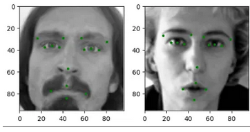
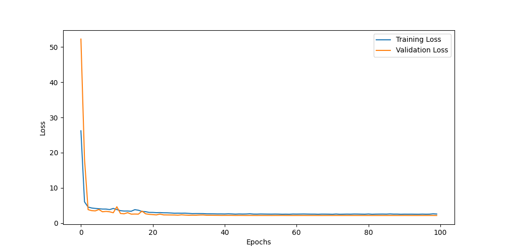
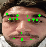

## EfficientFace

   

<p align = "center">
    
</p>

--- 

### Introduction

EfficientFace is a deep learning project focused on **facial keypoint detection** using **transfer learning** with **EfficientNet-B0**. The project explores how a pre-trained convolutional neural network can be adapted to a regression task when only a limited amount of labeled data is available.

In deep learning, training models from scratch is often impractical due to the large datasets and computational resources required. For this reason, **transfer learning** is widely used: a model pre-trained on a large dataset (such as ImageNet) is reused as a feature extractor and adapted to a new task. This approach allows the network to leverage previously learned visual representations, improving convergence speed and generalization.

Although closely related, transfer learning and fine-tuning are not exactly the same. Transfer learning refers to reusing a pre-trained model for a new task, usually by replacing the final layers. Fine-tuning is a specific strategy within transfer learning where some of the pre-trained layers are further trained on the target dataset. In this project, EfficientNet-B0 is used as a backbone and its classification head is replaced with a regression head for facial keypoints, while selected layers are frozen to control the learning process.

The main goal of this project is to gain practical experience with transfer learning while building a complete training and inference pipeline for facial keypoint regression.


---

### Repository Structure

```
EfficientFace/
│
├─ resources/           # resources for the project
├─ src/                 # Source code
│  ├─ albumentations.py # Custom augmentation functions
│  ├─ utils.py          # Dataset, model definition and training utilities
│  ├─ train.py          # Training pipeline
│  └─ inference.py      # Inference
├─ requirements.txt     # Project dependencies
└─ README.md
└─ LICENSE
```

### Dataset and dependencies

The dataset used in this project is the **Facial Keypoints Detection** dataset from Kaggle.

Due to size(**7k** images) and because it can be downloaded via *Kaggle* or *HugginFace*, the dataset is not included in this repository and is ignored via `.gitignore`.

It can be download from:
https://www.kaggle.com/competitions/facial-keypoints-detection/data


For the dependencies, this project uses **Python +3.12** with linux and the required dependencies are listed in `requirements.txt`. For this type of projects often is done via a virtual environment. 
To activate and activate de venv:

```bash
python3 -m venv venv
source venv/bin/activate ##Linux
pip3 install -r requirements.txt
```
---

### Source Code Overview

1. ```albumentations.py```

This module defines custom image augmentation functions, implemented to better understand how transformations work internally:

- ```Add_Gaussian_Noise```

- ```Add_Gaussian_Blur```

- ```Adjust_Brightness```

- ```Adjust_Contrast```

- ```Invert_GrayScale```

These augmentations are conceptually similar to ```torchvision.transforms``` but implemented manually for learning purposes.


2. ```utils.py```

This file contains several key components of the project:

**Custom Dataset** (```FK_dataset```)

A PyTorch ```Dataset``` class responsible for:

- Loading images and keypoints.

- Applying optional transformations.

- Filtering invalid keypoints (out of bounds or NaN).

- Returning (```image, keypoints```) tensors on the specified device.

**Model Definition** (```MyModel```)

EfficientNet-B0 is adapted for facial keypoint regression:

- The pre-trained EfficientNet-B0 backbone is used as a feature extractor.

- Early layers can be frozen using the ```grad_from``` parameter.

- The original classification head is replaced with a regression head consisting of a dropout layer and a fully connected layer.

- The output dimension corresponds to the number of facial keypoints.

**Training Utilities**

Includes helper functions used during training, one of the importants functions:

- ```train_one_epoch```, which computes both training and validation loss using **MSELoss**.


3. ```train.py```

This script implements the full training pipeline:

- Loads the dataset from CSV files using custom dataloaders.

- Defines:

    - Loss function: **Mean Squared Error (MSE)**

    - Optimizer

    - Learning rate scheduler(visualizing training improvement loss): ```ReduceLROnPlateau```

- Trains the model for 100 epochs.

- Saves the trained model weights to a ```.pth``` file.

**Results**:

- Final validation loss: approximately 2.3

- Given image resolution of 96×96, this corresponds to an average error of ~2.3 pixels per keypoint.

- **0%** overfitting because was applied to the model a ***dropout*** of 40% but probably needed more data

<p align = "center">
    
</p>

4. ```inference.py```

This script performs inference using the trained model:

- Loads the modified EfficientNet-B0 architecture and trained weights.

- Runs keypoint prediction on a video input.

- Writes the output as a GIF showing predicted facial keypoints.

**Observed behavior**:

- The model performs well when the face is clearly visible and less torsion.

- Performance **degrades** when the face is far from the camera due to the absence of bounding box preprocessing, the dataset and the backbone used.

- The limited dataset size (**~7k** images) also affects generalization.

- **Inference time** of the model at a ***GTX 1650Ti laptop*** with 96x96 images was of **8ms**

<p align="center">
    <a href="resources/inputs/selfievideo.gif">
        
    </a>
    <a href="resources/inputs/selfievideo2.gif">
        
    </a>
</p>

---

## Conclusions & Improvements

#### Conclusions
- Transfer learning enables effective facial keypoint detection with a relatively small dataset.

- EfficientNet-B0 provides a regular balance between performance and efficiency not enough data.

- The model achieves reasonable accuracy (~2.3 px error) on low-resolution images.

- Lack of face detection and limited data are the main constraints of the current approach.

#### Improvements

- Increase dataset size or use more advanced data augmentation techniques.

- Add a face detection step (bounding boxes) before keypoint regression.

- Experiment with larger backbones or different regression heads.

- Perform deeper fine-tuning and hyperparameter optimization.

---

## References

- Mastering Facial Keypoint Detection: A Comprehensive Transfer Learning Solution with PyTorch | Oleg Belkovskiy : 
https://medium.com/@oleg.belkovskiy/mastering-facial-keypoint-detection-a-comprehensive-transfer-learning-solution-with-pytorch-2c4a88fc6c2d

- What is Transfer Learning? | HugginFace: 
https://www.youtube.com/watch?v=BqqfQnyjmgg&t=4s

- Active Transfer Learning for Efficient Video-Specific Human Pose Estimation |  ComputerVisionFoundation Videos: 
https://www.youtube.com/watch?v=Mm5LfGH6A1I